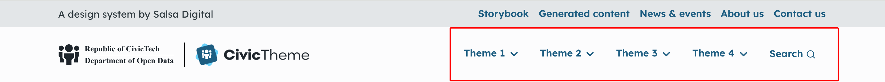

# Menus

CivicTheme uses four different styles of menu in the base theme. These are placed by block in different regions of the 
page.

You can control the component / style for the menu with the theme hook suggestion which can be configured in the Block 
configuration form.

## Primary Navigation

The dropdown menu is the primary navigation for the site.

<figure><figcaption>
Primary Menu Setup. Click on the image to zoom in.
</figcaption></figure>

For this menu to be themed correctly the menu block must be configured with `menu__civictheme_primary_navigation` theme hook suggestion in the HTML and style options of the Block configuration form.

<figure><figcaption>
Primary Navigation Theme Suggestion Hook Configuration. HTML and style options - Theme hook suggestion: civictheme_primary_navigation. Click on the image to zoom in.
</figcaption></figure>

## Secondary Navigation

The secondary navigation is a menu block placed in the top right of the page.

<figure><figcaption>
Primary Menu Setup. Click on the image to zoom in.
</figcaption></figure>

For this menu to be themed correctly the menu block must be configured with `menu__civictheme_secondary_navigation` theme hook suggestion in the HTML and style options of the Block configuration form.

<figure><figcaption>
Secondary Navigation Theme Suggestion Hook Configuration. HTML and style options - Theme hook suggestion: civictheme_secondary_navigation. Click on the image to zoom in.
</figcaption></figure>

## Mobile Navigation

The mobile navigation is a content block type. This block once created is placed is in the Header Middle 3 region.

There is no configuration needed for this block.

## Side Navigation

The side navigation is a menu block placed in the Side bar top left region of the page.

<figure><figcaption>
SideBar Navigation. Click on the image to zoom in.
</figcaption></figure>

For this menu to be themed correctly the menu block must be configured with `menu__civictheme_sidebar_navigation` theme hook suggestion in the HTML and style options of the Block configuration form.

<figure><figcaption>
Sidebar Navigation Theme Suggestion Hook Configuration. HTML and style options - Theme hook suggestion: civictheme_sidebar_navigation. Click on the image to zoom in.
</figcaption></figure>

## Footer Navigation

The default setup for the footer navigation is a menu block placed in each of the four middle regions of the footer.

<figure><figcaption>
Footer Menu Setup. Click on the image to zoom in.
</figcaption></figure>

For this menu to be themed correctly the menu block must be configured with `menu__civictheme_footer` theme hook suggestion in the HTML and style options of the Block configuration form.

<figure><figcaption>
Footer Theme Suggestion Hook Configuration. HTML and style options - Theme hook suggestion: civictheme_footer. Click on the image to zoom in.
</figcaption></figure>

