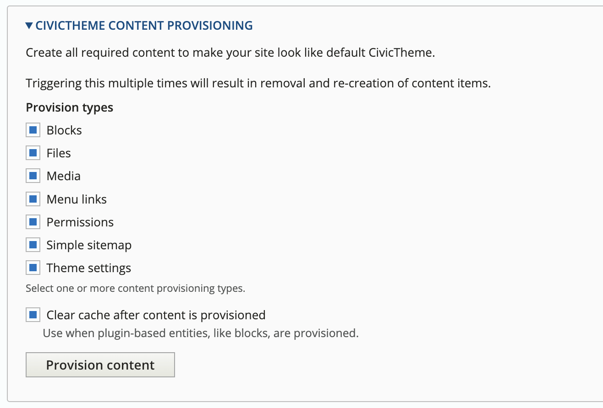

# Using in GovCMS SaaS

## Before you begin

* [ ] Get access to GitLab project
* [ ] Check that support ticket to enable config imports was actioned
* [ ] Check that production has your user added with administrator role
* [ ] Check that you have all [GovCMS SaaS required software](https://github.com/govCMS/GovCMS/wiki/1.1-Local-setup#dependencies) available on your machine
* [ ] Check that you have all NPM 8 and NodeJS 16 available on your machine
* [ ] Read this whole page to make sure you understand the steps

## Where to get help

See [Getting help](../../getting-started/getting-help.md) section

## Steps overview

### 1. Generic GovCMS setup

#### 1.1 Setup local

1. Clone the GitLab project locally.
2. Create a new branch `develop` from `master`.
3. ```sh
   # Login to GovCMS image repository
   docker login gitlab-registry-production.govcms.amazee.io -u <username>
   ```
4. ```sh
   ahoy up
   ```
5. Uncomment `MARIADB_DATA_IMAGE` line in `.env` file.
6. ```sh
   ahoy refresh-db
   ```
7.  Add the following file exclusions to `.gitignore`:

    ```gitignore
    .data
    *.sql
    *.tar.gz
    *.sql.gz

    themes/civictheme/civictheme_starter_kit
    themes/civictheme/civictheme-create-subtheme.php
    themes/civictheme/civictheme_govcms
    ```
8. ```sh
   # Unblock admin user (user 1 or generate a new one).
   ahoy drush user:unblock [username]
   ```

You can lookup username by logging into production site or by running:

```
ahoy drush uinf $(drush sqlq "SELECT GROUP_CONCAT(name) FROM users_field_data")
```

Now, if you run `ahoy login` you should be able to login to your local version of the site as an admin user.

#### 1.2 Export active configuration

1. ```sh
   # Pull latest production DB.
   ahoy refresh-db
   ```
2. If the above did not work OR hasn't been updated nightly - download a raw database file from [GovCMS Lagoon Projects](https://dashboard.govcms.gov.au/projects?=) from the “Backups” tab and import with `ahoy mysql-import .data/db.sql`
3. Run `ahoy drush cex` and commit configuration changes.
4. Push to remote and wait for deployment to complete.
5. Upon successful deploy, create a new Merge Request against `master` branch . This will get the active configuration into the main branch.
6. When merged, update your local branch against the latest `master`.


At this point, you should have a GovCMS project running in `master` environment in GovCMS SaaS with the default theme.


### 2. CivicTheme setup


It is advised to perform all changes in a dedicated (feature) branch to test this part before applying any customisations.


#### 2.1 Download CivicTheme theme

Since GovCMS SaaS does not allow to install themes via Composer, CivicTheme source must be installed as a custom theme.

1. [Download the latest CivicTheme release](https://www.drupal.org/project/civictheme/releases) and extract into `themes/custom` directory, rename the directory to `civictheme`.

#### 2.2 Enable required modules

Using an automated script to discover required modules from theme dependencies (Drupal does not support this OOTB):

```sh
ahoy drush ev "require_once dirname(\Drupal::getContainer()->get('theme_handler')->rebuildThemeData()['civictheme']->getPathname()) . '/theme-settings.provision.inc'; civictheme_enable_modules();"
```

#### 2.3 Clear caches


Do not skip this step


```sh
ahoy drush cr
```

#### 2.4 Enable admin and CivicTheme


CivicTheme MUST be enabled before your custom theme is enabled


```bash
# Enable CivicTheme and set as default.
ahoy drush theme:enable -y civictheme
ahoy drush config-set -y system.theme default civictheme
ahoy drush config-set -y media.settings standalone_url true

# Enable admin theme and set as default (optional).
ahoy drush theme:enable -y adminimal_theme
ahoy drush config-set -y system.theme admin adminimal_theme
```

#### 2.5 Remove GovCMS content types

CivicTheme GovCMS helper module `civictheme_govcms` serves the purpose to remove unnecessary entities and configuration that ships with GovCMS.

Install it locally to automatically remove the configuration from DB to later have it exported without GovCMS entities.

1.  Run in CLI container (`ahoy cli`):

    ```sh
    cd web/modules/contrib

    # Download and extract the helper module.
    # Ensure to use the latest tag (not Release) https://github.com/civictheme/civictheme_govcms/tags
    wget https://github.com/civictheme/civictheme_govcms/archive/refs/tags/<latest-tag>.tar.gz && tar -xvf <latest-tag>.tar.gz && rm <latest-tag>.tar.gz

    # Enable module, run the command to remove entities and uninstall a module.
    drush pm-enable -y civictheme_govcms
    drush civictheme_govcms:remove-config --preserve=user_roles
    drush pm-uninstall -y civictheme_govcms

    # Delete the module
    rm -Rf civictheme_govcms
    ```
2.  Export updated configuration

    ```sh
    ahoy drush cex -y
    ```

#### 2.6 Generate a sub-theme


Consider naming your theme as close as possible to the name of the site. Do not include `civic` or `civictheme` into name to avoid confusions in code when maintaining a theme in the future.


Run in CLI container (`ahoy cli`):

```sh
# Generate sub-theme (example overrides are removed using --remove-examples flag). 
# See php civictheme_create_subtheme.php --help
cd web/themes/custom/civictheme
php civictheme_create_subtheme.php <SUBTHEME_MACHINE_NAME> "<SUBTHEME HUMAN NAME>" "<SUBTHEME HUMAN DESCRIPTION>" ../<SUBTHEME_MACHINE_NAME> --remove-examples
```

This should result in 2 directories:

```
themes/civictheme
themes/<SUBTHEME_MACHINE_NAME>
```

#### 2.7 Install sub-theme and set as default

```sh
# Enable sub-theme.
ahoy drush theme:enable <SUBTHEME_MACHINE_NAME> -y
# Set sub-theme as default.
ahoy drush config-set system.theme default <SUBTHEME_MACHINE_NAME> -y
```

#### 2.8 Build front-end assets

1.  Run on your host:

    ```sh
    cd themes/<SUBTHEME_MACHINE_NAME>
    nvm use
    npm install
    npm run build
    ```
2. Check that directory `themes/<SUBTHEME_MACHINE_NAME>/dist` was created.
3. Navigate to your site and assert that default styling was applied.

#### 2.9 Commit built assets

1.  Modify `.gitignore` file in your new theme and remove the following lines\\

    ```
    storybook-static
    dist
    components_combined
    .components-civictheme
    ```
2. Commit built assets.

#### 2.10 Provision content

CivicTheme comes with pre-set Block Content blocks configuration. Since Drupal does not support running install hooks in themes, a custom content provisioning script has to be used.

The provisioning needs to be run twice:

1. Locally - to capture created configuration for config entities (blocks, menus etc.)
2. In production - to populate the configuration with the default content. This step will be covered in the “Deployment” section below.

Run locally:

1. Login to the local instance of your site.
2.  Navigate to `/admin/appearance/settings/<SUBTHEME_MACHINE_NAME>`\\

    <figure><figcaption></figcaption></figure>
3. Press "Provision content" button.
4. Navigate to the homepage and observe that all blocks and menus are present.
5.  Export config for created entities:

    ```
    ahoy drush cex -y
    ```
6. Commit and push to remote.
7. Wait for deployment to finish and login to the Drupal instance.
8. Navigate to `/admin/appearance/settings/<SUBTHEME_MACHINE_NAME>`.
9. Press "Provision content" button.
10. Navigate to the homepage and observe that all blocks and menus are present.


After deployment and provisioning your remote **feature environment** should look like a [default CivicTheme site](https://default.civictheme.io/) without homepage content.


### 3. Deployment

#### 3.1 Deploy to (pre-)production

1. Merge feature branch to `master` (or `develop` and then to `master`).
2. Commit and push to remote.
3. Wait for deployment to finish and login to the Drupal instance.
4. Navigate to `/admin/appearance/settings/<SUBTHEME_MACHINE_NAME>`.
5. Press "Provision content" button.
6. Navigate to the homepage and observe that all blocks and menus are present.


After deployment and provisioning your remote **(pre-)production** environment should look like a [default CivicTheme](https://default.civictheme.io/)[ site](https://default.civictheme.io/) without homepage content


#### 3.2 Cleanup


Only run this step once everything is working and looking as expected.


1. ```sh
   # Remove unnecessary files.
   rm themes/civictheme/civictheme_create_subtheme.php
   rm -Rf themes/civictheme/civictheme_starter_kit
   ```
2. Commit and push to remote.

### 4. Customising CivicTheme

1. Replace sub-theme logos in repository `themes/<SUBTHEME_MACHINE_NAME>/assets/logos` with site-specific versions.
2. [Update the colour palette](../../content-authoring/site-wide-configuration/colours.md) with your sub-theme.
3. Update sub-theme `screenshot.png` with something more appropriate (optional).
4. `npm run build` and commit changes.

### 5. Updating CivicTheme

See [Version update](broken-reference)

## Resolving issues with roles

1. Enable `Role Delegation` module and allow `Site Administrator` to delegate both GovCMS and CivicTheme roles. Ensure that CivicTheme roles have the same permissions with their GovCMS counterparts.
2. Login to the site and re-assign existing users from GovCMS roles to relevant CivicTheme roles.
3. Remove GovCMS admin roles and re-export configuration.
